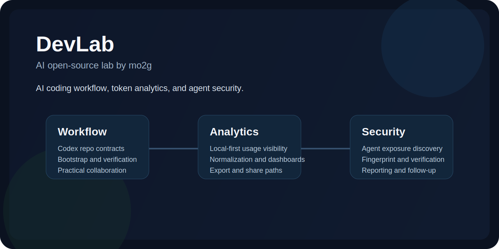

# DevLab

[中文主页](./README.zh-CN.md)

DevLab is the public entry point for AI work I build, maintain, or actively contribute to around three themes: AI coding workflow, token analytics, and agent security.

## Start Here

- [Chinese overview](./README.zh-CN.md)
- [Documentation](./docs/README.md)
- [AI project index](./docs/ai/README.md)
- [Cookbook](./docs/cookbook/README.md)

## About

I use this repository as a documentation-first front page for current AI projects and as a durable home for earlier multi-language experiments. The goal is practical: show what I am building, what I am maintaining, and how I approach AI developer tooling in real repositories.

## Featured Projects

| Project | Role | Domain | Stack | Status |
| --- | --- | --- | --- | --- |
| [Token Insight](./docs/ai/token-insight.md) / [Repo](https://github.com/mo2g/token-insight) | Builder / Maintainer | Local-first token observability for AI coding tools | Rust, React, SQLite | Active build |
| [Codex Composer](./docs/ai/codex-composer.md) / [Repo](https://github.com/mo2g/codex-composer) | Builder / Maintainer | Reproducible Codex workflow bootstrap for repositories | JavaScript, Shell, Markdown | Active iteration |
| [AgentScan](./docs/ai/agentscan.md) / [Repo](https://github.com/AutoScan/agentscan) | Contributor / Maintainer | Exposed AI agent discovery and security audit | Go, React, SQLite | Active security tooling |

## Related AI Work

- [one-api](https://github.com/mo2g/one-api): maintenance-oriented fork work around LLM gateway and API distribution scenarios.
- [MetaGPT](https://github.com/mo2g/MetaGPT): participation via fork-based exploration of multi-agent software workflows.

## Cookbook

- [Cookbook Index](./docs/cookbook/README.md)
- [How I Think About Codex Workflow Automation](./docs/cookbook/codex-workflow-automation-tradeoffs.md)
- [Codex Composer development notes](./docs/cookbook/codex-composer-workflow.md)
- [Token Insight local-first analytics notes](./docs/cookbook/token-insight-local-first-analytics.md)
- [AgentScan engineering notes](./docs/cookbook/agentscan-agent-security-notes.md)

## Legacy Lab

Earlier experiments remain available as reference code:

- [golang](./golang)
- [java](./java)
- [js](./js)
- [php](./php)
- [python](./python)

## Collaboration

I am interested in collaborations around AI developer tools, internal AI workflow enablement, local-first analytics, and agent security. DevLab is structured to make that evaluation quick: projects, notes, and older experiments are all linked from one place.
